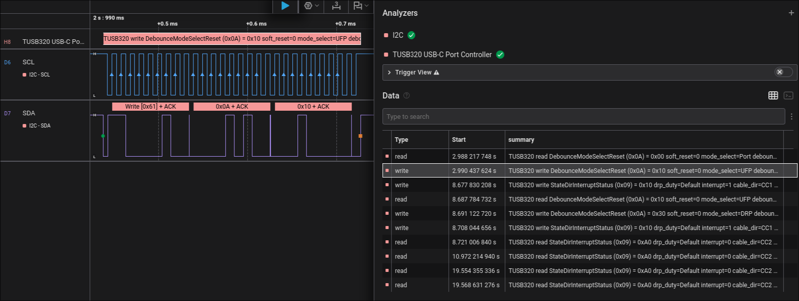

# TUSB320 USB-C Port Controller HLA

Saleae Logic 2 High Level Analyzer for TI TUSB320 I2C traffic.

## Use

1. In Logic 2, open Extensions.
2. Add this folder as a local extension: `screenshots/tusb320_hla`.
3. Add the `TUSB320 USB-C Port Controller` HLA above an I2C analyzer.
4. Leave `i2c_address` at `0` to use the default TUSB320 7-bit address `0x61`, or set another 7-bit address.

The decoder recognizes:

- Chip ID reads from `0x00..0x07`
- `CurrentModeDetectAdvertise` at `0x08`
- `StateDirInterruptStatus` at `0x09`
- `DebounceModeSelectReset` at `0x0A`, including `mode_select`, `soft_reset`, and debounce fields
